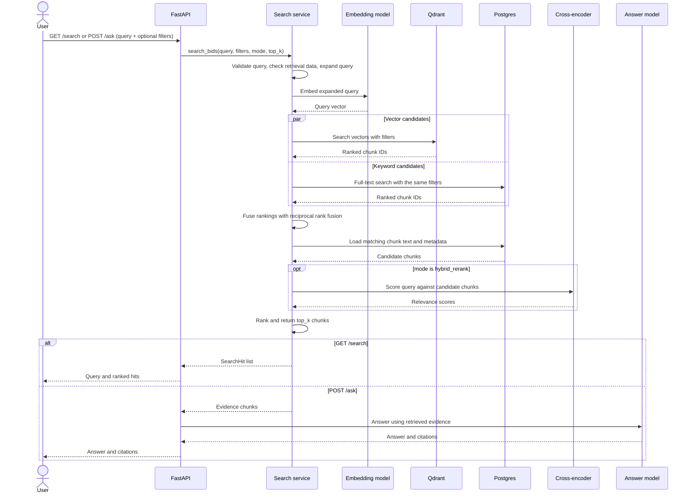

# RFP Intelligence Platform

Search and structured extraction for bid folders. Each immediate subfolder of `data/` is one bid. HTML and PDF files, including addenda, are parsed with Docling, stored in PostgreSQL, and embedded in Qdrant only when you start that step for that bid. A LangGraph multi-agent system answers questions and writes a cited JSON record. Nothing in the code is hard-coded to the two sample bids.

## Architecture

The diagram shows how a user query is retrieved. `GET /search` returns ranked chunks; `POST /ask` continues from those chunks to generate an answer with citations. `POST /extract` is a separate agent workflow. Documents must already be parsed, chunked, and embedded before retrieval.



PostgreSQL is the system of record and stores chunk text and metadata; Qdrant stores vectors and chunk IDs. Both retrieval branches apply the requested bid/document filters. `hybrid` returns the fused order, while `hybrid_rerank` adds the cross-encoder before truncating to `top_k`. Search and ask require Qdrant to contain indexed points. Each extraction agent step is written to `agent_steps` and to the JSON log.

## Design decisions

- **Parser.** Docling converts PDF and HTML into a `DoclingDocument`. Table structure uses TableFormer fast mode. OCR runs only on PDF pages that have no extractable text; a digital page uses its text layer. Heading hierarchy is enabled when the installed Docling build exposes it. Items are grouped under the heading in scope. Headers and footers stay out of the body tree.
- **Chunking.** Chunk reads the sections and tables already stored for that bid. It does not parse the file again. Each chunk stays under one heading path, and a split table repeats its header. The heading path is prefixed onto the chunk text so the embedding sees the section title. Chunks do not cross sections.
- **Embeddings and reranking.** `BAAI/bge-small-en-v1.5` embeds chunks at index time. `BAAI/bge-reranker-base` reranks the fused candidate set. Both are local.
- **Hybrid search.** Vectors miss exact bid numbers, part numbers, and model numbers. The same chunk rows are searched with PostgreSQL full text (`tsvector` / `ts_rank`). The two top-20 lists are merged with reciprocal rank fusion, then reranked to `top_k`. A new folder does not rebuild the keyword index; the `tsvector` is generated on insert.
- **Manual pipeline.** The API does not watch `data/` and does not enqueue jobs. In the Pipeline page you pick one bid and run Parse, then Chunk, then Embed. Parse writes `source_files`, `sections`, and `tables` (only files whose sha256 changed). Chunk writes `chunks`. Embed writes Qdrant points and sets `chunks.embedded_at`. The same page shows the rows for the step you select. `python main.py index --bid` still runs all three steps for that one folder.
- **Agents.** LangGraph holds the plan, evidence, draft fields, and validation in one state object. Four specialists (identity, logistics, commercial, product) run in parallel and read one section at a time. The addendum agent keeps the value from the highest addendum number. The validator sends a field back through retrieval at most twice. Waits use exponential backoff with full jitter: `min(8s, 0.5s * 2^attempt) + jitter`. The same helper covers LLM 429/5xx/timeouts (5 attempts) and failed ingestion jobs (3 attempts).
- **LLM.** OpenRouter model `nvidia/nemotron-3.5-lightning:free` via `OPENROUTER_API_KEY`. Structured outputs are Pydantic models. A missing fact is `null` with notes `Not found in documents`. A value without a citation is rejected.

## Setup

Python 3.12+. Copy the environment file and set your OpenRouter API key:

```bash
copy .env.example .env
```

Install dependencies:

```bash
uv pip install -r requirements.txt
```

Start Postgres and Qdrant, then the API. Pending SQL files in `migrations/` are applied on startup. Bid folders are not parsed until you run a pipeline step:

```bash
docker compose up postgres qdrant
python main.py serve
```

Or start everything, including Streamlit. The API container applies `migrations/*.sql` before it starts listening:

```bash
docker compose up --build
```

The API is on port 8000 and Streamlit is on port 8501. Put bid folders in `data/`. Open the Pipeline page, choose a folder, and run Parse, Chunk, and Embed. Search, Ask, and Extract stay disabled until Qdrant has points.

## How to run each mode

```bash
python main.py index --bid "./data/Bid 1"
python main.py search "closing date" --bid "Bid 1" --top-k 5
python main.py extract --bid "Bid 1"
python main.py ask "Which affidavits are required for the Dell laptop bid?" --bid "Bid 2"
streamlit run ui/streamlit_app.py
```

HTTP: `GET /pipeline/status`, `GET /pipeline/rows?bid_id=Bid 1&step=sections`, `POST /pipeline/parse`, `POST /pipeline/chunk`, `POST /pipeline/embed`, `POST /index` (all three steps), `GET /search`, `POST /ask`, `POST /extract`, `GET /extractions?bid_id=Bid 1`.

Extraction writes `output/<bid folder>.json` and `output/traces/<run id>.json`. A structural trace from the orchestrator test is in `examples/traces/example_extract_trace.json`.

## Tests

```bash
pytest
```

Unit tests cover classification, hash diffs, section and table grouping, chunk metadata, reciprocal rank fusion, query expansion, backoff, citation validation, addendum reconciliation, Recall@5 / MRR, and the extract graph with a mocked model. The Docling HTML fixture test runs when Docling is installed.

## Deliverables

### Retrieval evaluation

`eval/questions.jsonl` has 18 questions across both bids. Each row names the bid, a file-name fragment, and a passage that must appear in a retrieved chunk. The `/search/evaluate` endpoint reports Recall@5 and MRR for `hybrid` and `hybrid_rerank`.

| # | Question | Bid | Hybrid Recall@5 | Hybrid MRR | Hybrid + reranker Recall@5 | Hybrid + reranker MRR |
| ---: | --- | --- | ---: | ---: | ---: | ---: |
| 1 | What is the solicitation number for the student and staff computing devices bid? | Bid 1 | 1 | 1 | 1 | 1 |
| 2 | What is the title of Bid 1? | Bid 1 | 1 | 0.33 | 0 | 0 |
| 3 | What is the closing date for the Dallas student devices? | Bid 1 | 1 | 0.5 | 1 | 1 |
| 4 | What is the closing date for the Dallas student devices RFP? | Bid 1 | 0 | 0 | 0 | 0 |
| 5 | Which organization issued the student computing devices solicitation? | Bid 1 | 1 | 1 | 1 | 1 |
| 6 | When is the prebid conference for Bid 1? | Bid 1 | 1 | 1 | 1 | 1 |
| 7 | What is the procurement email for the Dallas ISD device bid? | Bid 1 | 1 | 1 | 1 | 0.5 |
| 8 | What phone number is listed for Dallas ISD procurement? | Bid 1 | 0 | 0 | 1 | 0.33 |
| 9 | How long are the contracts resulting from the Dallas device RFP? | Bid 1 | 1 | 0.33 | 1 | 0.5 |
| 10 | When are questions due for the student and staff computing devices bid? | Bid 1 | 1 | 1 | 1 | 1 |
| 11 | What is the solicitation number for the Dell laptop bid? | Bid 2 | 1 | 0.5 | 1 | 1 |
| 12 | What is the title of the Dell laptop solicitation? | Bid 2 | 1 | 1 | 1 | 1 |
| 13 | What is the closing date for the Dell laptop bid? | Bid 2 | 1 | 1 | 1 | 1 |
| 14 | Who issued the Dell laptops with extended warranty bid? | Bid 2 | 1 | 0.5 | 1 | 0.33 |
| 15 | Who is the contact for the Maryland Dell laptop bid? | Bid 2 | 1 | 1 | 1 | 1 |
| 16 | What email is listed for the Dell laptop procurement contact? | Bid 2 | 1 | 1 | 1 | 0.33 |
| 17 | Which Dell Latitude model is requested? | Bid 2 | 1 | 0.33 | 1 | 0.5 |
| 18 | What dock model is included with the Dell laptops? | Bid 2 | 1 | 0.33 | 1 | 1 |

### Sample Q&A log

This section would demo atleast 10 questions & the detailed log including agent, input json, output json with citations, latency, and tokens used.

```
{
    "agent": "qa",
    "input_json": {
      "question": "What is the submission deadline for Bid 1 after all addendums?"
    },
    "output_json": {
      "answer": "The submission deadline for Bid 1 after all addendums is July 9, 2024 at 2:00 PM CST. This deadline was set by Addendum 2, which extended the original due date. Addendum 1 did not change the submission deadline.",
      "citations": [
        {
          "file": "Addendum 2 RFP JA-207652 Student and Staff Computing Devices.pdf",
          "page": 1,
          "section": null
        }
      ]
    },
    "tokens": 4013,
    "latency_ms": 40458,
    "created_at": "2026-10-03T09:01:31.830461+00:00"
  }
```
```
{
    "agent": "qa",
    "input_json": {
      "question": "Which affidavits are required for the Dell laptop bid?"
    },
    "output_json": {
      "answer": "The Mercury Affidavit is required within 45 days of Award. Cite: PORFP_-_Dell_Laptop_Final.pdf, page 2.",
      "citations": [
        {
          "file": "PORFP_-_Dell_Laptop_Final.pdf",
          "page": 2,
          "section": null
        }
      ]
    },
    "tokens": 5723,
    "latency_ms": 290020,
    "created_at": "2026-10-03T09:13:49.360867+00:00"
  }
```
```
{
    "agent": "qa",
    "input_json": {
      "question": "Compare the warranty requirements of both bids."
    },
    "output_json": {
      "answer": "Bid 1 (Dallas ISD RFP JA-207652): Minimum warranty requirements are one year for student Chromebooks and three years for student and staff Windows laptops, as stated on page 1 of Addendum 1. Warranties must be official manufacturer warranties, with additional break-fix repair programs available as optional pricing in attachments. Vendors must be responsible for all materials and accessories per page 3 of the FINAL.pdf. Bid 2 (Maryland PORFP #E20P4600040): Three-year warranty required following the date of delivery for all machines purchased, specifically as FA V (Manufacturer's Extended Warranty) per page 3 of PORFP_-_Dell_Laptop_Final.pdf. Requires a Dell Limited Hardware Warranty Extended certificate and affidavit presentation. The warranty period is fixed at 3 years post-delivery with no tiered options mentioned in the evaluation criteria.",
      "citations": [
        {
          "file": "JA-207652 Student and Staff Computing Devices FINAL.pdf",
          "page": 3,
          "section": "Warranty and Warranty Repair Work"
        },
        {
          "file": "Addendum 1 RFP JA-207652 Student and Staff Computing Devices.pdf",
          "page": 1,
          "section": "Document"
        },
        {
          "file": "PORFP_-_Dell_Laptop_Final.pdf",
          "page": 3,
          "section": "Evaluation Criteria"
        },
        {
          "file": "PORFP_-_Dell_Laptop_Final.pdf",
          "page": 1,
          "section": "Purchase Order Request for Proposals (PORFP) Hardware Master Contract"
        }
      ]
    },
    "tokens": 7056,
    "latency_ms": 27494,
    "created_at": "2026-10-03T09:19:23.471181+00:00"
  }
```
```
{
    "agent": "qa",
    "input_json": {
      "question": "Is a bid bond required for Bid 1, and if so, how much?"
    },
    "output_json": {
      "answer": "Not found in documents",
      "citations": []
    },
    "tokens": 4831,
    "latency_ms": 19715,
    "created_at": "2026-10-03T09:23:49.453127+00:00"
  }
```
```
{
    "agent": "qa",
    "input_json": {
      "question": "What changed in Addendum 2 compared to the original RFP for Bid 1?"
    },
    "output_json": {
      "answer": "Addendum 2 extended the RFP due date to July 9, 2024 at 2:00 PM CST. All other provisions and terms remain unchanged from the original RFP.",
      "citations": [
        {
          "file": "Addendum 2 RFP JA-207652 Student and Staff Computing Devices.pdf",
          "page": 1,
          "section": "Document"
        }
      ]
    },
    "tokens": 6981,
    "latency_ms": 256666,
    "created_at": "2026-10-03T09:32:11.259182+00:00"
  }
```
```
{
    "agent": "qa",
    "input_json": {
      "question": "Which organization issued the student computing devices solicitation?"
    },
    "output_json": {
      "answer": "Dallas Independent School District",
      "citations": [
        {
          "file": "Student and Staff Computing Devices __SOURCING #168884__ - Bid Information - {3} _ BidNet Direct.html",
          "page": null,
          "section": "JA-207652 - Student and Staff Computing Devices **SOURCING #168884** > Basic Information"
        }
      ]
    },
    "tokens": 3036,
    "latency_ms": 266663,
    "created_at": "2026-10-02T14:49:53.941225+00:00"
  }
```
```
{
    "agent": "qa",
    "input_json": {
      "question": "When is the prebid conference for Bid 1?"
    },
    "output_json": {
      "answer": "The prebid conference for Bid 1 is scheduled for 06/10/2024 at 03:00 PM EDT.",
      "citations": [
        {
          "file": "Student and Staff Computing Devices __SOURCING #168884__ - Bid Information - {3} _ BidNet Direct.html",
          "page": null,
          "section": "Dates"
        },
        {
          "file": "Student and Staff Computing Devices __SOURCING #168884__ - Bid Information - {3} _ BidNet Direct.html",
          "page": null,
          "section": "Pre-Bidding Events"
        }
      ]
    },
    "tokens": 4068,
    "latency_ms": 52328,
    "created_at": "2026-10-02T14:52:02.056617+00:00"
  }
```
```
{
    "agent": "qa",
    "input_json": {
      "question": "Who is the procurement contact for the student and staff computing devices bid?"
    },
    "output_json": {
      "answer": "The procurement contact for the Student and Staff Computing Devices bid (RFP JA-207652, SOURCING #168884) is Procurement Services, reachable at 972-925-3700 or ProcurementCS@dallasisd.org.",
      "citations": [
        {
          "file": "Student and Staff Computing Devices __SOURCING #168884__ - Bid Information - {3} _ BidNet Direct.html",
          "page": null,
          "section": "JA-207652 - Student and Staff Computing Devices **SOURCING #168884** > Contact Information"
        }
      ]
    },
    "tokens": 3315,
    "latency_ms": 31384,
    "created_at": "2026-10-03T09:37:41.760027+00:00"
  }
```
```
{
    "agent": "qa",
    "input_json": {
      "question": "What is the procurement email for the Dallas ISD device bid?"
    },
    "output_json": {
      "answer": "ProcurementCS@dallasisd.org",
      "citations": [
        {
          "file": "Student and Staff Computing Devices __SOURCING #168884__ - Bid Information - {3} _ BidNet Direct.html",
          "page": null,
          "section": null
        }
      ]
    },
    "tokens": 3991,
    "latency_ms": 99527,
    "created_at": "2026-10-02T14:55:01.014712+00:00"
  }
```
```
{
    "agent": "qa",
    "input_json": {
      "question": "What laptop model does the Maryland bid request?"
    },
    "output_json": {
      "answer": "The Maryland bid request (BPM044557 for Dell Laptops w/Extended Warranty) specifies the **Dell Latitude 5550** as the laptop model.",
      "citations": [
        {
          "file": "Dell Laptops w_Extended Warranty - Bid Information - {3} _ BidNet Direct.html",
          "page": null,
          "section": "BPM044557 - Dell Laptops w/Extended Warranty > Contact Information"
        },
        {
          "file": "Dell_Laptop_Specs.pdf",
          "page": 1,
          "section": "SKU Description"
        }
      ]
    },
    "tokens": 4513,
    "latency_ms": 8540,
    "created_at": "2026-10-03T09:40:43.883854+00:00"
  }
```

### Agent Trace

Ask Mode: A full sample user question agent trace is provided in `examples/traces/full_trace_ask_mode.json`

JSON Output files for complete extraction process for each bid folder is present in below directories:
1. Bid 1: `output/Bid 1.json`
2. Bid 2: `output/Bid 2.json`

### Demo Video
https://www.loom.com/share/b20c3bd895904d36b5bd538dfa4132f4

## Assumptions and limitations

- A bid is one immediate subfolder of `data/` containing `.pdf`, `.html`, or `.htm` files. Document type comes from the file name (`addendum`, `affidavit`, `specs`, HTML bid page, otherwise RFP).
- The first run downloads Docling layout models and the two BAAI models.
- Ask and Extract call OpenRouter. The free nvidia/nemotron-3.5-lightning:free model is rate-limited, so a full extraction can pause or retry when the daily cap is hit. FYI for Bid 1, full extraction process was not carried out due to LLM model rate-limit.
- OCR uses Docling's OCR pipeline. A page that is still empty after OCR is logged and skipped; the rest of the folder is indexed.
- Go/no-go scoring and a CI eval job are not included.
